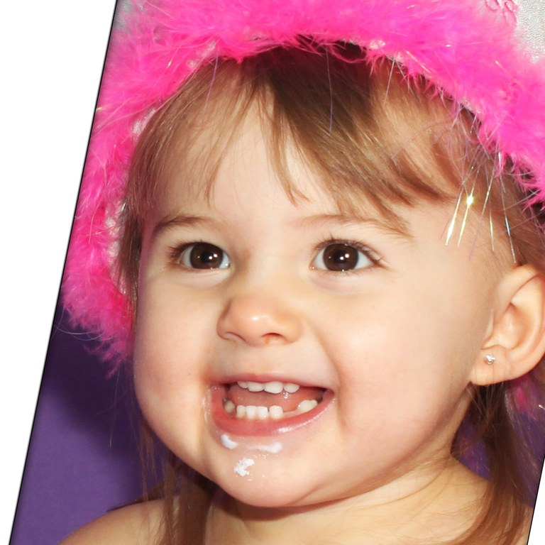
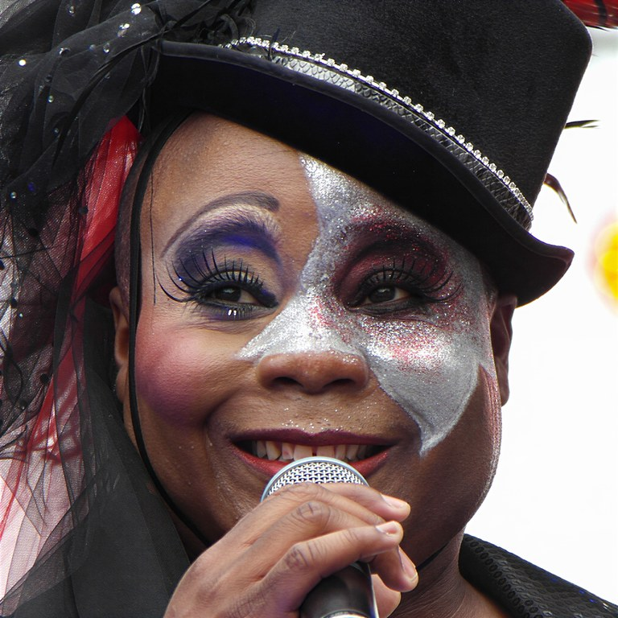
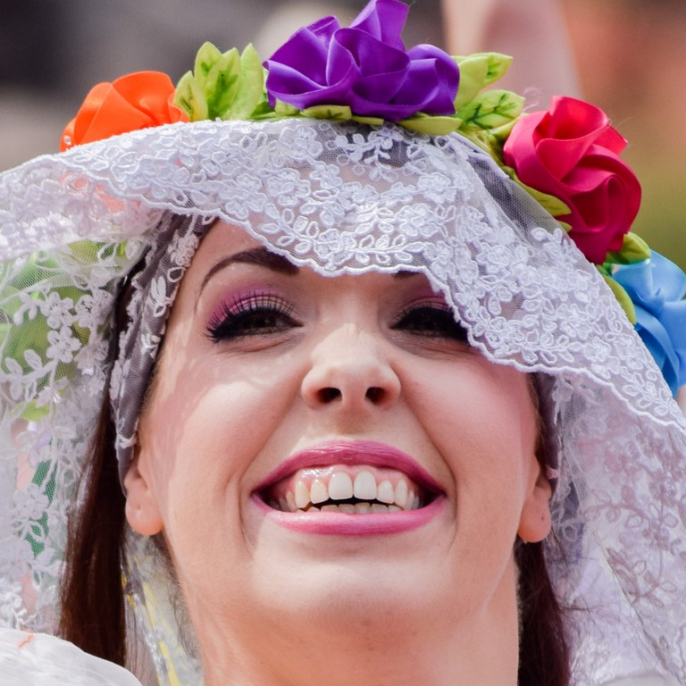
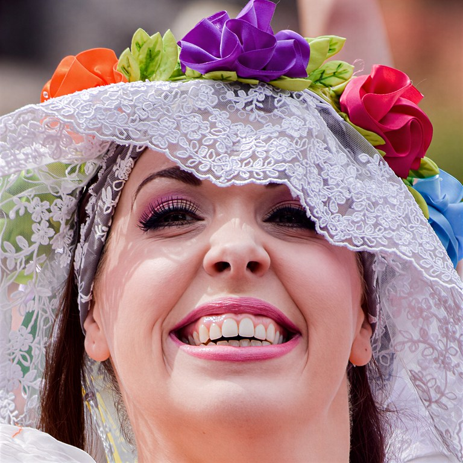

# FFHQ-2048 — NanoPocket Enhanced

> **The first new high-quality public face dataset since 2019.**
> 1,000 sharp, artifact-free **2048×2048** portraits, derived from FFHQ and re-mastered with the [NanoPocket Face Enhance](https://nanopocket.ai/) model.

<p align="center">
  <a href="https://huggingface.co/datasets/Nanopocket-ai/FFHQ-2048">
    </a>
  <a href="https://huggingface.co/spaces/Nanopocket-ai/FFHQ-2048-demo">
    </a>
  
  
</p>

<p align="center">
  <a href="https://huggingface.co/spaces/Nanopocket-ai/FFHQ-2048-demo">
    <b>👉 Open the live drag-to-compare slider with mouse-wheel zoom</b>
  </a>
</p>

---

## Why this dataset exists

FFHQ (NVIDIA, 2019) has been the gold-standard face dataset for the past five years — but the field has moved on. Modern generators (Flux, SD3 / SDXL, StyleGAN-T, portrait restoration nets) train at **1024² and above**, and they expose every soft pixel, every JPEG ghost, every out-of-focus eyelash that the original FFHQ contains. Yet **no comparable public face dataset has been released since FFHQ**.

We built **FFHQ-2048** to fill that gap:

- **2× spatial resolution** — 1024×1024 → **2048×2048**.
- **Sharper, more detailed faces** — pores, hair strands, iris texture, fabric weave.
- **Artifact-free** — no over-sharpening halos, no plastic skin, no identity drift.
- **Filename-compatible with original FFHQ** — `00000.png` here corresponds to FFHQ index `0`, so you can swap it in to existing pipelines without rewriting code.

This GitHub repo announces a **public preview of the first 1,000 images**. The full 70,000-image enhanced set is available on request — see [Want the full set?](#want-the-full-enhanced-ffhq) below.

---

## Before / after — six samples

GitHub strips iframes, so the table below shows static thumbnails. **For an interactive drag-to-compare slider with mouse-wheel zoom, [open the demo on Hugging Face Spaces ↗](https://huggingface.co/spaces/Nanopocket-ai/FFHQ-2048-demo).**

| FFHQ index | Original — 1024² | Enhanced — 2048² |
| :--: | :--: | :--: |
| `00046` |  |  |
| `00166` |  |  |
| `00394` |  |  |
| `00874` |  |  |
| `00894` |  |  |
| `00991` |  |  |

> The differences look subtle at thumbnail scale. **Open the [interactive demo ↗](https://huggingface.co/spaces/Nanopocket-ai/FFHQ-2048-demo) and zoom in** — that's where the recovered detail (skin pores, iris texture, individual hair strands, fabric weave) becomes obvious.

---

## Dataset summary

| Field | Value |
| --- | --- |
| Number of images | **1,000** |
| Resolution | **2048 × 2048** |
| Format | PNG, lossless |
| Total size | ~5.4 GB |
| Filename pattern | `data/{index:05d}.png` (e.g. `data/00042.png`) |
| Index range | `00000` – `00999` (matches original FFHQ indices) |
| Source | NVIDIA FFHQ `images1024x1024` first 1,000 |
| Enhancement | NanoPocket Face Enhance |

```
Nanopocket-ai/FFHQ-2048   (Hugging Face dataset)
├── README.md
└── data/
    ├── metadata.csv          # file_name, ffhq_index, original_split
    ├── 00000.png
    ├── 00001.png
    └── ... 998 more
```

`data/metadata.csv` lives next to the images, so the standard `datasets` ImageFolder loader picks it up automatically.

---

## Quick start

```bash
pip install -U datasets huggingface_hub pillow
```

A runnable script with all three patterns lives in [`quickstart.py`](quickstart.py).

### Option 1 — `datasets` library (with metadata)

```python
from datasets import load_dataset

ds = load_dataset("Nanopocket-ai/FFHQ-2048", split="train")
print(ds)                       # 1000 rows: image, ffhq_index, original_split
print(ds[0]["image"].size)      # (2048, 2048)
print(ds[0]["ffhq_index"])      # 0
ds[0]["image"].save("sample.png")
```

### Option 2 — `huggingface_hub` snapshot (full local copy)

```python
from huggingface_hub import snapshot_download

local_dir = snapshot_download(
    repo_id="Nanopocket-ai/FFHQ-2048",
    repo_type="dataset",
    allow_patterns=["data/*", "README.md"],
)
print(local_dir)                # contains data/00000.png ... data/00999.png + data/metadata.csv
```

### Option 3 — Single image via raw URL

```python
import io
import requests
from PIL import Image

url = "https://huggingface.co/datasets/Nanopocket-ai/FFHQ-2048/resolve/main/data/00042.png"
img = Image.open(io.BytesIO(requests.get(url).content))
img.show()
```

---

## Want the full enhanced FFHQ?

This repo is a **public preview**. We have re-mastered the **entire 70,000-image FFHQ** to 2048² with the same pipeline. If the previewed quality fits your research or product, get in touch:

> **Email: [marketing@nanopocket.ai](mailto:marketing@nanopocket.ai)**
>
> Tell us briefly:
> 1. Who you are (lab / company / individual).
> 2. What you plan to use the data for.
> 3. Whether the use is non-commercial (FFHQ's CC BY-NC-SA 4.0 inheritance applies).
>
> We will respond with a delivery method (LFS bundle, S3 link, or a private HF dataset invite).

---

## About NanoPocket Face Enhance

NanoPocket Face Enhance is our in-house face restoration / super-resolution model, optimised to (a) preserve identity, (b) recover micro-detail (skin pores, hair, iris, lip texture) and (c) avoid the typical pitfalls of SR networks — over-sharpened halos, plastic skin, and waxy artifacts.

If you would like to use this model locally, please also contact: **[marketing@nanopocket.ai](mailto:marketing@nanopocket.ai)**.

---

## License & attribution

This dataset is a derivative work of **NVIDIA's Flickr-Faces-HQ (FFHQ)** dataset. Per FFHQ's license terms we **inherit the same license** and clearly **indicate the changes** we made.

- **Dataset license:** [Creative Commons BY-NC-SA 4.0](https://creativecommons.org/licenses/by-nc-sa/4.0/) — free use, redistribution and adaptation **for non-commercial purposes**, with attribution and share-alike.
- **Per-image licenses:** the underlying photographs were originally collected from Flickr under one of:
  - [CC BY 2.0](https://creativecommons.org/licenses/by/2.0/)
  - [CC BY-NC 2.0](https://creativecommons.org/licenses/by-nc/2.0/)
  - [Public Domain Mark 1.0](https://creativecommons.org/publicdomain/mark/1.0/)
  - [Public Domain CC0 1.0](https://creativecommons.org/publicdomain/zero/1.0/)
  - [U.S. Government Works](http://www.usa.gov/copyright.shtml)
  Per-image author and license are recorded in the original [`ffhq-dataset-v2.json`](https://github.com/NVlabs/ffhq-dataset) metadata, indexed by the same numeric IDs used in this repo.
- **Indicated changes:** every image has been **upscaled 2×** (1024×1024 → 2048×2048) and **detail-enhanced** by NanoPocket Face Enhance. No re-cropping, re-alignment or content edits beyond enhancement were performed.

### Important — Not for facial recognition

> Reproducing NVIDIA's explicit clause: **this dataset is not intended for, and should not be used for, the development or improvement of facial recognition technologies.**

---

## Privacy & removal requests

We respect the same privacy / opt-out process as the upstream FFHQ dataset. To request removal of a photo of yourself:

1. On Flickr, do **one** of: tag the photo with `no_cv`, change the licence to All Rights Reserved or any CC `NoDerivs` variant, set the photo to private, or delete it.
2. Email **[researchinquiries@nvidia.com](mailto:researchinquiries@nvidia.com)** (the upstream maintainers) with your Flickr username.
3. **Also** email us at **[marketing@nanopocket.ai](mailto:marketing@nanopocket.ai)** so we can remove the corresponding enhanced image from this repo and any future releases.

---

## Citation

If you use this dataset, please cite **both** the original FFHQ paper and this release:

```bibtex
@inproceedings{karras2019stylebased,
  title     = {A Style-Based Generator Architecture for Generative Adversarial Networks},
  author    = {Tero Karras and Samuli Laine and Timo Aila},
  booktitle = {Proceedings of the IEEE/CVF Conference on Computer Vision and Pattern Recognition (CVPR)},
  year      = {2019},
  url       = {https://arxiv.org/abs/1812.04948}
}

@misc{nanopocket2026ffhq2048,
  title        = {FFHQ-2048: A 2K Re-master of Flickr-Faces-HQ via NanoPocket Face Enhance},
  author       = {NanoPocket},
  year         = {2026},
  howpublished = {\url{https://huggingface.co/datasets/Nanopocket-ai/FFHQ-2048}},
  note         = {Public preview release. Full 70k set available on request.}
}
```

---

## Acknowledgements

- **NVIDIA / NVlabs** for releasing the original FFHQ dataset.
- **Tero Karras, Samuli Laine, Timo Aila** for the StyleGAN paper that introduced FFHQ.
- **Vahid Kazemi & Josephine Sullivan** for the face-alignment work that made the original collection possible.
- The Flickr photographers who shared their work under permissive licences.

---

## Star ⭐ this repo

If FFHQ-2048 is useful to your work, **starring this repo** helps other researchers discover it and signals to us that the community wants the full 70k release prioritised.

---

## Changelog

- **v1.0 (2026-04)** — Initial public release: first 1,000 images, 2048×2048, NanoPocket Face Enhance v1.
